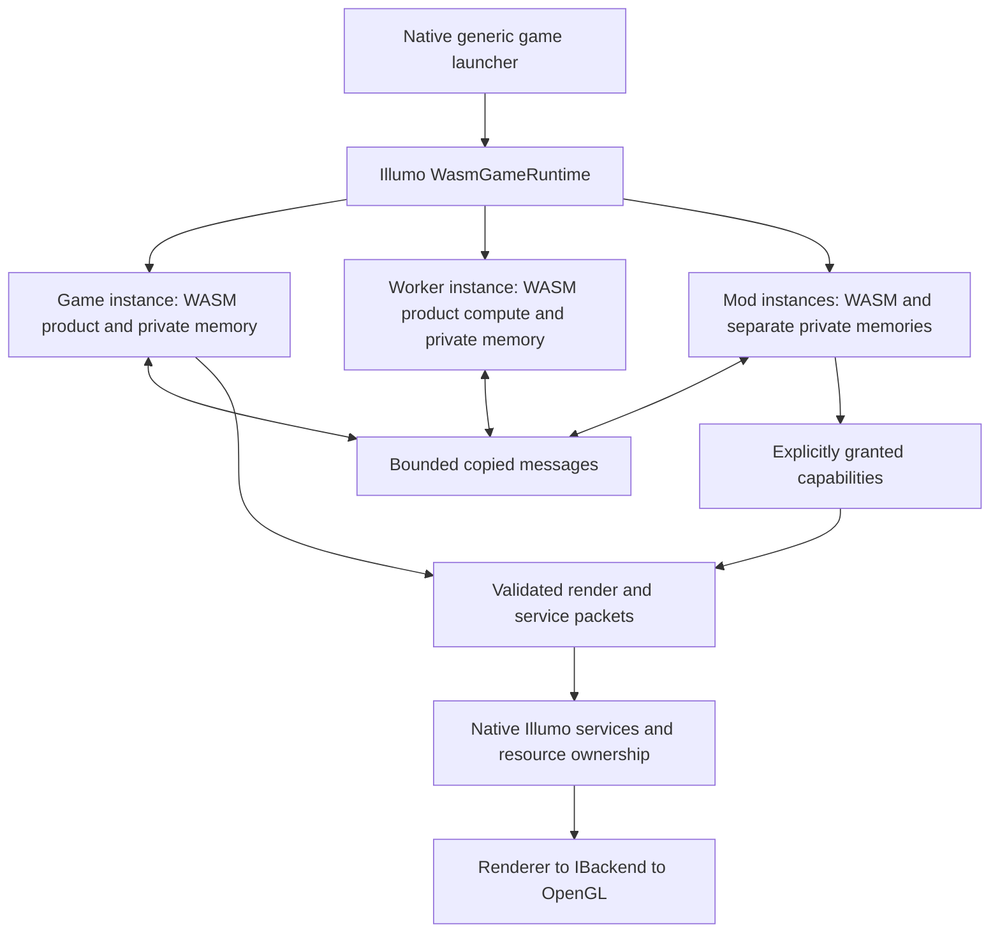

# Isolated whole-game WASM runtime

Status: approved 2026-09-19; implementation and runtime validation in progress.
Date: 2026-09-19. Inspected baseline: `release/v26.09`, `6050a373`.
Execution record: [wasm-game-runtime-plan.md](wasm-game-runtime-plan.md).

## 1. Objective and acceptance contract

Run all application-specific executable code for IllumoGame, and future game
targets using this interface, inside an embedded WebAssembly sandbox. Native
Illumo remains the operating-system and rendering host. The purpose is isolated,
replaceable game code and mods.

The complete CSim product belongs in WASM: startup/default policy, menus, input
interpretation, commands, cell storage/evaluation, rules, editing, patterns,
catalogs, save codecs, view-cache sampling, color fading and UI behavior. Moving
only rules into WASM, or hiding native simulation behind an import, does not meet
this contract. Shared engine helpers may be compiled into a guest library.

Completion requires all of the following:

1. A generic native game launcher loads a package; its executable and native
   dependency closure contain no IllumoGame production translation units.
2. CSim runs from its WASM package with the existing product behaviors and save
   compatibility, verified through the sandbox execution path.
3. A second, independently built game package runs in the same unchanged host.
4. A sample isolated mod changes game behavior through a declared game API.
   Its failure or forged handles cannot access another guest's private state.
5. Every product computation, including asynchronous generation and any later
   accelerated CPU kernels, executes as WASM. Native imports stay generic.
6. Missing or invalid WASM fails visibly. There is no native product fallback.

WASM JIT compilation still produces CPU machine instructions. The invariant is
that those instructions execute under the WASM runtime's memory/call contracts;
it is not an instruction to use an interpreter.

Not included: migrating native editor/viewer tools into WASM, adding physics or
audio, selecting another graphics API, a mod marketplace, multiplayer, arbitrary
live-state migration on reload, or rewriting working domain algorithms merely
to adopt a new language. Existing native tool consumers retain their interface.

## 2. Current evidence and why a loader alone is insufficient

| Current surface | Evidence | Required change |
|---|---|---|
| Native static product | `IllumoGame/CMakeLists.txt:3-37` | Cross-compile product sources; unlink them from shipping native launcher |
| Native product factory | `IllumoGame/Source/Game/IllumoGameApplication.cpp:12-60` | Manifest identity/CLI metadata and guest initialization |
| Pointer-based module services | `Illumo/Include/Illumo/Engine/IllumoContext.h:17` | Guest-facing value API, not an exported context pointer |
| Native background generation | `IllumoGame/Source/Game/SimulationRunner.cpp:144-243` | Guest worker execution and explicit state transport |
| Shared worker memory | `IllumoGame/Source/Game/SparseWorkerPool.h:48-72` | Guest execution strategy; no native CA callback escape hatch |
| Pointer-bearing renderer tokens | `Illumo/Include/Illumo/Rendering/RenderCommand.h:143-196` | Separate validated wire records and owned host staging |
| Direct streams/catalog paths | `IllumoGame/Source/Game/IllumoCodec.cpp`, `RuleCatalogLoader.cpp` | Guest codecs over capability-scoped byte I/O |
| Native menu transitions | `IllumoGame/Source/Game/MainMenuModule.cpp:396` | Guest-local module/screen lifetime |

The inspected production sources and CMake contain no first-party WASM loader
or guest target. `docs/sessions/2026-08-27-wasm-loader-and-gol-port.md` is an
older, narrower proposal, explicitly not a closed decision. Its referenced
`script-host` branch and `90e10d26` commit do not resolve locally. This design
supersedes its native-product restriction for the requested migration, without
rewriting that historical record.

The canonical book was already read in this review. Its PDF is newer than the
examined LaTeX source timestamps, so preparing this proposal requires no rebuild.

## 3. Chosen architecture



Three independent contracts:

- **Host ABI:** generic lifecycle, input/events, assets, rendering, storage,
  worker jobs, commands and diagnostics. Owned by Illumo and versioned.
- **Guest SDK:** source-level C++ helpers for math, UI composition, camera,
  resource wrappers, messages and guest-local screen/module lifetime. Compiles
  to WASM; it is not a binary copy of the native Illumo public API.
- **Game mod API:** product-owned schemas and extension endpoints. CSim can
  expose patterns, rules and editing actions; another game can expose entirely
  different concepts without adding imports to Illumo.

The native `WasmGameModule` adapts the existing required-module lifecycle to
the runtime. It owns no game-domain object. Native `IModule` continues serving
IllEd, IllMeshViewer and DebugModule. Menu/game transitions happen inside the
guest, rather than replacing the native required module for each screen.

## 4. Runtime and toolchain proposal

Recommend Wasmtime through its C API, kept private to `Illumo/Source/Wasm`.
Recommend a pinned WASI SDK compiler/sysroot for the C++ guest. Initial
compatibility candidates are Wasmtime 48.0.2 and wasi-sdk 34; this is a proposal,
not evidence that this exact pair successfully builds/runs IllumoGame.

The first implementation gate must prove on Windows x64:

- compile/link/load a reactor-style C++23 guest without a process `main`;
- static constructors, explicit teardown, allocations and STL containers;
- caught C++ exceptions, stack unwinding/destructors and `bad_alloc` handling;
- integer/float/SIMD behavior needed by the game and GLM;
- checked memory growth, fuel/epoch interruption and instance teardown;
- two independent guest instances executing on different native threads.

Do not silently disable exception paths or assume `<thread>` availability means
thread spawning works. The SDK documents extra exception flags and experimental
thread targets. This proposal uses serial entry per instance and message-based
workers; it does not depend on guest pthreads or shared linear memories.

Use core WASM and a small explicit ABI for this migration. Component-model
bindings can be evaluated later; they are not required to establish isolation.
Use no unrestricted WASI filesystem/process/environment/network bindings. Any
libc-required imports must be enumerated and provided narrowly, or removed by
guest source adapters. A toolchain target name grants no runtime capability.

### Dependency assessment for approval

| Dependency | Benefit | License / maintenance | Build and deployment impact |
|---|---|---|---|
| Wasmtime C API | Mature embedded runtime, isolated memories, execution limits | Upstream Apache-2.0 WITH LLVM-exception; exact release and transitive notices must be inventoried | Add one private native dependency; pin archive/source hashes and matching headers/library; stage runtime binary if dynamically linked |
| WASI SDK | Reproducible Clang/libc++ WASM compilation | Preserve exact distribution notices and sysroot runtime-library attribution | Separate cross-build toolchain; compiler is build-time tooling, linked guest libraries still need redistribution review |

Wasmtime maintenance includes upstream security updates and a documented release
process. Pinning a version is not permission to ignore patches. Public headers
must not expose Wasmtime types. Runtime binary size, startup/compilation time,
CRT compatibility and packaging are measured in the first gate.

Neither dependency is installed or added by this proposal. Wasmtime and a WASM
inspection utility were not found on PATH during this review; LLVM and CMake
were found. That does not rule out tools installed elsewhere.

Primary references, checked 2026-09-19:

- [Wasmtime C/C++ API](https://docs.wasmtime.dev/c-api/)
- [Wasmtime interruption semantics](https://docs.wasmtime.dev/examples-interrupting-wasm.html)
- [Wasmtime configuration and blocking-host-call limits](https://docs.wasmtime.dev/api/wasmtime/struct.Config.html)
- [Wasmtime release process](https://docs.wasmtime.dev/stability-release.html)
- [Wasmtime 48.0.2 license](https://github.com/bytecodealliance/wasmtime/blob/v48.0.2/LICENSE)
- [WASI SDK targets and limitations](https://github.com/WebAssembly/wasi-sdk)
- [WASI SDK C++ exception configuration](https://github.com/WebAssembly/wasi-sdk/blob/main/CppExceptions.md)

## 5. Package and lifecycle

Proposed package layout:

```text
games/csim/
  game.json
  game.wasm
  worker.wasm          # optional package role, compiled from game code
  assets/              # catalogs, images and other product data
  licenses/
mods/example/
  mod.json
  mod.wasm
```

The bounded JSON manifest declares package ID/version, host ABI major/minor,
required features, WASM role paths, asset root, display/CLI metadata, requested
capabilities, game API compatibility and limits. Native code parses generic
metadata; CA defaults and rule semantics remain guest code/data. No executable
native callback is generated from product policy.

Package requests are not grants. The host computes actual rights and limits.
Unknown required features/imports, unsupported ABI majors, malformed manifests,
missing guests and incompatible mod API versions reject activation clearly.
Package paths stay inside the package; user-selected files receive separate
capabilities. No guest-controlled search of DLLs/native executable code.

Conceptual exports (names and layouts become an ABI header in milestone 1):

| Export | Contract |
|---|---|
| `illumo_guest_describe` | ABI/features and bounded metadata |
| `illumo_guest_init` | Initialize guest with copied startup/config data |
| `illumo_guest_update` | Consume ordered events/completions and frame timing; advance game or mod behavior |
| `illumo_guest_frame` | Produce a complete render frame after update and game validation of queued mod requests |
| `illumo_guest_close` | Accept or defer close; product confirmation remains guest UI |
| `illumo_guest_shutdown` | Best-effort guest cleanup; never required for host cleanup |
| `illumo_guest_receive` | Receive explicitly routed game/mod messages at a safe scheduling point |
| `illumo_guest_job` | Worker-role entry with copied job data; no graphics/UI authority |
| `illumo_guest_alloc/free` | Controlled transient transfer buffer allocation |

The host supplies elapsed time; the guest owns simulation policy, fixed-step
accumulation and dropped-debt behavior. Keep events ordered and maintain the
existing optional-overlay-before-product input precedence. Guest-local menu
transitions explicitly retire handlers/resources and discard stale input.

Store access is serialized. Imports must not recursively invoke the same guest
or call another guest synchronously. Native callbacks enqueue owner-tagged events.

## 6. ABI, isolation and resource ownership

Use fixed-width integers, explicit lengths and tagged record versions. Encode
wire data explicitly little-endian. Do not transfer native enums, bool layout,
STL objects, vtables, `std::function`, C++ pointers or `size_t` layouts.
Strings are bounded UTF-8 spans; matrices are explicit float arrays. Guest memory
offsets are validated with overflow-safe arithmetic on every access.

Each principal (base game or mod) has its own store/memory and resource table.
Worker roles are child principals of their game with reduced rights and separate
memories. No mod shares the base game's linear memory. Native typed handles are
not an authorization mechanism: guest IDs map through owner/type/generation
validation to retained native resources. Rights cannot be gained by guessing an
ID, naming another package or copying a serialized handle.

Host imports copy requests before returning, or process bounded read-only values
within the invocation. No native command retains a guest-memory address. Memory
growth, the next callback, guest unload and traps must not invalidate accepted
host data. Checked host operations contain exceptions and return status values.

Capabilities cover resource creation, packaged asset reads, private storage,
selected-file access, clipboard, console registration, display requests and
job/message submission. Mods get a minimal game-granted subset; game APIs grant
operations, not arbitrary access to the game's service bag.

Quotas cover linear memory, aggregate child-worker memory, tables/stack, compiled
module input, instructions/time, pending requests, handles, upload bytes and GPU
allocations. Game packages cannot raise ceilings themselves. Proposed starting
profiles for measurement: up to 1 GiB per CSim control/worker memory, 64 MiB per
small mod, and 64 MiB per frame packet; aggregate host budgets also apply.
These are configurable limits, not claims of equivalent native world capacity.
WASM32 address space and copying can reduce maximum world sizes; characterize
supported sizes before release and reject oversized loads transactionally.

A trap/time-budget failure retires the affected instance and rejects unpublished
output. It does not undo already mutated guest memory and is not resumed as if
the export succeeded. Worker failure retains the last published world; a game
failure shows a native failure surface and permits a clean restart. A failed
mod is disabled and its authority revoked without stopping the base game.

Revoke capabilities immediately on retirement, discard uncommitted frames and
cancel requests where possible. Physical native resource destruction waits for
accepted-frame leases and in-flight operations to release their references.
Independent service requests already accepted, such as an atomic file write,
are not rolled back by a subsequent guest trap; their completion/durability
contract is separate from transactional frame publication.

CPU fuel/epochs do not bound time spent inside native imports, decoding or GPU
work. Keep imports bounded or asynchronous, enforce asset/upload budgets, and
do not offer arbitrary native shader execution to untrusted mods. Developer
shader assets require an explicitly trusted capability. The sandbox assumes a
correct runtime and host bridge; it is not a separate OS process or a guarantee
against driver/runtime vulnerabilities.

## 7. Rendering bridge and guest SDK

Keep product presentation decisions in WASM. CanvasView continues to sample the
world, select LOD, fade colors and find dirty uploads there. UI layout, hit tests,
animation and painter ordering also execute there.

Do not serialize `RenderCommand` directly. Introduce a versioned frame packet:

```text
header: ABI, owner/session, frame sequence, record counts, payload length
records: camera, ordered 2D batches, world instances, clips, buffer/texture writes
payload: copied vertices, indices, pixels and explicit value arrays
```

The invoking runtime instance supplies authoritative ownership. Any owner/session
field in guest data is checked against that context and can never select another
principal's resource table.

Guest SDK helpers emit this packet. The host validates lengths, indices, strides,
finite transforms, resource ownership, layers and quotas before publishing any
frame. Resource acquisition is a separate request/completion path; frame packets
refer to acquired guest IDs. Packet rejection has no partial logical commit.
Submitted render data stays provisional until the producing export returns
successfully and full packet validation completes; a trap discards that data.
GPU failures after acceptance report an incomplete frame; no claim of physical
GPU rollback is made.

Accepted frames own all CPU payload storage through shadow collection, depth,
color and synchronous submission. Host frame leases retain referenced assets
even if a guest requests release. A native generic packet drawable translates
accepted records through the existing Renderer/token path.

World instance records include resolved transforms, conservative bounds, stable
instance identity, geometry/material references and shadow settings. Generic
native attachment adapters preserve shared-shadow collection/fitting. Product
hierarchy and gameplay state stay in the guest; a second native CA/world model
is not introduced. Unknown/invalid rendering bounds retain established fail-open
policy after rejecting malformed numeric data.

Split reusable helpers at real dependencies: math/TRS, geometry composition,
animation clocks and layout can compile into the SDK; native Renderer/window
pointers cannot. Refactor reusable implementation pieces rather than maintain
divergent copies. Guest-native helpers may use ordinary C++ pointers internally;
only the host boundary forbids them.

Native font loading supplies copied immutable glyph metrics and a guest-scoped
atlas reference. Guest text measurement/layout emits glyph quads, avoiding
per-glyph host calls. Preserve current text geometry and clipping through parity
tests. No `shared_ptr<Font>` crosses the ABI.

## 8. Simulation concurrency and publication

Recommended initial model: control/game instance plus one persistent worker
instance, both running the game's WASM code. Control callbacks run on the native
main thread at normal product update points; the worker store is entered by one
host-owned worker thread. Native scene/window/OpenGL calls remain main-thread
affine. The worker can only exchange bounded bytes, log within limits and observe
its execution budget. It cannot call UI, dialogs or rendering services.

CSim control owns the published grid and view. The compute instance owns working
grids and rule state. Jobs carry a session/epoch, generation, operation ID and
guest-defined payload. The host does not decode a cell, rule or generation delta.

CSim guest transport carries topology/rule definitions plus actual state changes.
The native optimization `fullReplacement && fullChunks.empty()` relies on reading
the other grid directly; it cannot cross isolated memories. Replace that marker
with a real chunk snapshot or a negotiated chunk transfer. Large transfers use
bounded streaming records with validation before publication.

Retain one outstanding generation. Completions matching the current session,
rule/world revision and request sequence publish only at a control-frame boundary.
Failures leave the published world unchanged. After an edit, send the correct
base revision plus changes, or a full resynchronization when needed.

Convert blocking drain-before-edit/load/ruleset/exit into an explicit pending
operation: stop new jobs, continue pumping frames/completions, retire or consume
the outstanding result, then mutate. Never wait for a worker while holding a
store lock or a native callback needed to complete that worker. User input cannot
silently apply against a different generation. Shutdown can cancel and retire a
worker; guest-local cleanup must not be required for host progress.

Inside the compute guest, first exercise existing serial kernels for correctness.
That is an intermediate checkpoint, not permission to ship a parallel-performance
regression. If necessary, partition coarse tasks across additional WASM workers;
all CA packing/merging stays guest code. Shared-memory guest pthreads would be a
separate reviewed optimization with toolchain and memory-ownership proof. Do not
move kernels native to meet a benchmark.

This model trades zero-copy shared grids for explicit isolation and transferable
state. Measure duplicate storage, delta bytes, marshaling and compute separately.
If copying or serial execution fails the agreed gates, resolve that before final
cutover; the engine/product boundary must not be weakened as a shortcut.

## 9. Other services and compatibility

| Surface | Guest responsibility | Native mechanism |
|---|---|---|
| Input | Actions, tools, navigation, screen capture decisions | Bounded ordered frame snapshots after console capture; no global queue exposure |
| Console | Product handlers, validation/completion policy | Namespaced metadata and endpoint IDs; queued dispatch, stale-owner rejection |
| Configuration | Defaults, product validation and serialization | Per-package storage; separate capability for fullscreen/VSync/etc. |
| Files | Catalog precedence, codecs, filenames/extensions and save semantics | Read/write selected capabilities; bounded streaming; atomic replace |
| Dialogs | Product labels/filters and response handling | Async request IDs and selected-file capabilities; distinct cancel/error/denied results |
| Clipboard | RLE/pattern interpretation | Bounded permitted UTF-8 transfer |
| Transitions | Guest-local menu/game ownership | Native host only switches complete packages |
| Close | Product save/confirmation UI | Generic defer/accept handshake and forced shutdown cleanup |
| Diagnostics | Game metrics and timing labels | Guest-safe logging/profiling imports; no native Tracy client in guest |

Keep sparse `.csim` version 4 output and older v3/v2/dense reads. Preserve rule
IDs, family semantics, palette/brush behavior, finite topology, signed 64-bit
coordinates, inspector, workshop, pattern operations, reduced motion and footer
input reservation. Preserve CLI-visible product identity through manifest
metadata and guest startup arguments.

Existing executable/current-directory catalog discovery needs a migration map:
read-only packaged base catalogs plus explicitly granted legacy overlay roots,
with existing user files preserved. Private per-game storage becomes the default
for new packages. Never copy arbitrary host directories into guest authority or
overwrite user settings during staging. Verify precedence and Unicode paths.

Native command closures point only to the generic adapter and owner identity;
they enqueue guest endpoints. Native services must not retain a guest function
pointer. Imports never synchronously reenter a guest. Late dialog/file/job
completions are discarded after instance generation changes.

## 10. Mods and hackability

The base game is an ordinary package, not a privileged native extension. Mods
use separately instantiated WASM and a negotiated game API. The host routes
bounded messages by endpoint and grant; CSim interprets pattern/rule/tool data.

Define deterministic ordering: delivered completions, game pre-update, enabled
mods in manifest-resolved order, game application of validated mod requests,
then game frame production. Cyclic dependencies are rejected. Unbounded recursive
mod calls are prevented by queued delivery and per-frame budgets. Responses
include request/session IDs; a mod cannot force another guest to execute inline.

These are separate completed invocations: base-game `illumo_guest_update`, each
mod's permitted update, base-game `illumo_guest_receive` for the bounded request
batch, then base-game `illumo_guest_frame`. The host never pauses an export to
reenter a guest or interleave a mod. Requests produced after the delivery phase
wait for the next defined delivery point.

A first sample must perform a visible CSim customization through guest-owned
validation, plus a failing mod proving cleanup. Native code must contain no
`next_state`, `SparseCellGrid`, CSim command handler or per-cell callback ABI.
Changes that require new generic host features increment/extend the host ABI;
changes to game meaning version the game's API.

Live reload initially means clean stop/start of an instance. State continuity
requires an explicit game-defined versioned checkpoint and validation. Raw WASM
memory snapshots are not a portable save or migration contract.

## 11. Build and source changes

Proposed source homes; final file subdivision follows implementation pressure:

| Area | Work |
|---|---|
| `Illumo/Source/Wasm/` | Private Wasmtime provider, runtime, host imports, capability/handle tables, jobs and lifecycle |
| `Illumo/Include/Illumo/Wasm/` | Native package/runtime API without Wasmtime or product types |
| `IllumoGuest/Include/IllumoGuest/`, `IllumoGuest/Source/` | Public wire contract and guest-compiled SDK |
| `Illumo/Source/Engine/` | Generic WasmGameModule and package-launch path; preserve native-tool runner |
| Rendering/GUI | Shared value/geometry helpers and native copied-packet adapters |
| `IllumoGame/Source/Game`, `Rulesets` | Guest services, lifecycle, data I/O, worker messages and all product behavior |
| `IllumoGame/CMakeLists.txt` and new guest build entry | Cross-compiled package; native product code limited to reference tests |
| Root CMake, `cmake/`, `build.py` | Reproducible native plus separate WASM toolchain builds and staging |
| `Templates/` | Minimal second game using only the guest SDK and manifest |
| Tests/tools | Artifact boundary checker, adversarial guests, parity runner, GPU capture and measurements |

CMake remains authoritative. Separate build directories/toolchains are required;
do not attempt native and wasm32 compilation with one CMake C++ compiler setting.
An explicit toolchain root and pinned runtime dependency are required. Normal
configure must not download unverified binaries or mutate global installations.

The native shipping launcher links Illumo/runtime only. Product source targets
may remain native for reference tests while migrating, but never become a silent
runtime fallback. Generate a source/link manifest and inspect the complete native
target dependency closure, not just symbol names, to enforce this.

Unmodified arbitrary native games will not automatically run. A target game
must compile for the selected guest toolchain and use the guest ABI/SDK. The
generality proof is a second unrelated package, not an unsupported promise that
every existing C++ library can be loaded unchanged.

## 12. Alternatives and trade-offs

| Option | Decision |
|---|---|
| Script rules only, native game shell | Reject: does not isolate the complete game |
| Native DLL mods | Reject for this request: no WASM memory/capability isolation |
| Port engine and GPU execution into guest | Unnecessary for native embedding; keep generic trusted services native |
| Export native C++ interfaces directly | Reject: pointers/lifetimes/layout cannot form the sandbox boundary |
| One guest, full generation in frame callback | Useful test checkpoint; not the chosen responsive simulator architecture |
| Shared-memory WASM pthreads immediately | Defer pending explicit runtime/toolchain validation; larger concurrency contract |
| Serial-per-instance WASM workers with messages | Recommended baseline; clear isolation, with copying and parallel-throughput risks |
| New ECS/retained widget tree/render graph | Not required; preserve established domain/UI/rendering models |

## 13. Verification and release gates

### Isolation and implementation identity

- Native executable/dependency source manifests contain no game production
  objects; installed package without game.wasm fails, rather than loading native
  game code. Inspect guest imports and refuse native escape hooks.
- Two independent games run through unchanged host; game and mod memory remain
  disjoint. Worker compute is guest code, demonstrated through guest traces/tests.
- Test forged/cross-owner/stale/wrong-type handles, malformed spans/UTF-8/packets,
  overflow counts, denied files/clipboard, late callbacks, infinite loops, memory
  growth, failed init and repeated load/unload. Fuzz native decoders/imports.
- Overwrite/grow/destroy guest memory after frame acceptance; native rendering
  still uses its owned copy. Trap/unload revokes authority immediately; retained
  native references retire only after accepted-frame/in-flight leases end.

### Behavioral parity

- Compare native-reference and WASM state hashes for every neighborhood family,
  sparse/frontier/dense cases, negative/large coordinates and toroidal seams.
- Exercise real guest scheduling, cancellation/publication and mutation barriers;
  include full-replacement marker conversion and worker restart/resynchronization.
- Golden save bytes and v4/v3/v2/legacy read fixtures; failed/truncated/oversized
  loads preserve prior world. Verify catalog overlays and file transactionality.
- Route menus, commands, settings, selection, clipboard, workshop and close
  confirmation through the guest; inspect native window/dialog/Unicode behavior.
- MockBackend parity for painter order, text, clips, dirty uploads and shadows;
  GPU capture comparisons plus interactive CSim and diagnostic-scene smoke.

### Performance and capacity

Record hardware, build configs, Wasmtime/SDK versions, runtime feature flags,
VSync/cap settings, seeds and identical workloads. Establish current native
production and native serial baselines before replacing the runner.

Measure sparse moving patterns, dense random Life, settled worlds, Wireworld,
histogram/directional families, elementary history, finite wrap, zoom/pan and
large edit/load cases. Report warm p50/p95/max frame work and generation latency,
achieved TPS, input responsiveness, startup/JIT time, synchronization/upload
bytes and guest plus native peak memory.

Proposed initial regression gates for review: at least 80% of baseline achieved
TPS and no more than 25% p95 frame-work regression on the frozen representative
suite, with no lost input/publication or unbounded wait. Compare against native
production worker settings, not only an artificially serial reference. Record
the supported world-size envelope and quota failures separately. If these gates
are unsuitable or fail, revisit them explicitly; do not label a serial prototype
or silent native fallback as completion.

### Repository validation

Full Release workspace build and labeled CTest; relevant clang-format/tidy;
native bridge ASan and decoder fuzzing; guest parity tests run under the actual
runtime. Native coverage does not establish WASM execution coverage. Report
guest-case coverage separately and retain the native 85% gate for its applicable
production subset. Do not lower coverage by silently excluding migrated code.
Windows is the first acceptance platform; no new Linux support claim follows.

## 14. Migration, rollback and documentation

Implement in the companion plan's order. Keep current native reference tests
available until parity. Do not cut over shipping CSim until the complete guest
path passes; a missing intermediate capability leaves the migration incomplete.
If a gate fails, stop cutover and repair within the agreed boundary. Returning
to a previous release is a deployment decision, not an automatic native fallback.

After design acceptance, synchronize `docs/architecture-consensus.md`, charter
direction, relevant package maps/README, LaTeX runtime/render/game chapters,
formal decision log, dependency notices and the durable root/nested guidance
whose contracts change. Preserve historical session notes. Do not mark the
decision closed or features shipped while the runtime is only a proposal.

## 15. Approval boundary and unresolved evidence

Requested approval covers this architecture, the private Wasmtime dependency
and guest compiler toolchain, replacement of native product factories/service
pointers with the guest ABI, and message-based simulation workers. The first
implementation milestone resolves compiler/runtime compatibility before bulk
product migration. No git mutation or publication is requested.

Unverified: exact toolchain-pair compatibility, byte/CPU cost of cross-instance
world synchronization, wasm32 world capacity, GUI parity, runtime binary/CRT
packaging and all proposed performance gates. These are explicit implementation
gates, not claims of support. A runtime/worker-model change beyond this proposal
requires revisiting the affected design, rather than silently widening it.

Repository authority: `.agent/PLANS.md` Tier 3 requires a detailed design to be
discussed and explicitly authorized before implementation. `docs/contributing.md`
requires author approval for a new dependency. This document makes those choices
reviewable; no production implementation is included in the proposal.
